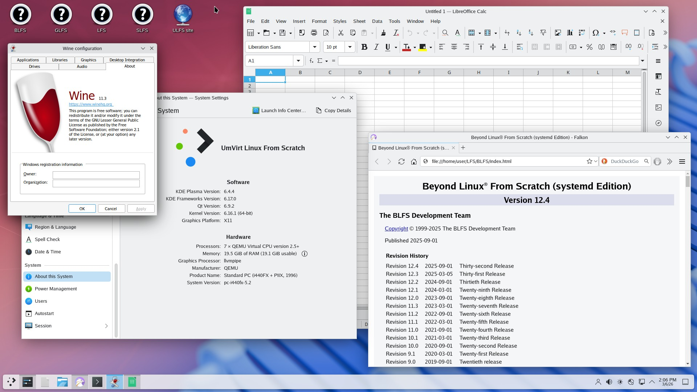

# Umvirt Linux From Scratch packages database

Version:  0.2.3 

Based on: Linux From Scratch 12.3 (March 2025)

Status: Archieved. Some packages are broken or missing.

## About

This database is contain information which needed by Umvirt Packages service to download, extract, configure, build and install source code packages and their dependencies.

## License

This database is licensed under GNU GENERAL PUBLIC LICENSE Version 3, 29 June 2007

Source packages license information can be found on source packages files and their official sites.

## Screenshot

## Demo

It's possible to try ULFS 0.2.3 on Live DVD/USB. 

No installation is needed. Just download and run.

Download: [http://downloads.umvirt.com/ulfsvm/0.2.3/samples/demo/](http://downloads.umvirt.com/ulfsvm/0.2.3/samples/demo/)

## Installation or update

### Database

- Go to ULFS Packages directory

- Copy contents of this directory in tmp/0.2.3 directory

- Go to bin directory in ULFS Packages directory

- Import this database by running

        ./load_data --path=../tmp/0.2.3 --release=0.2.3 --format=xml

### Files

- Download source package files. 
    - To download release specific files with wget go to temporary directory and run: 

            wget -x -i http://%repository_name%/linux/packages/files/0.2.3/wget

    - then copy files to storage directory with path "0.2.3/packages".

- Download source package patches. 
    - To download release specific patches with wget go to temporary directory and run: 

            wget -x -i http://%repository_name%/linux/packages/patches/0.2.3/wget

    - then copy patches to storage directory with path "0.2.3/patches".

- Scan files and add it to database

        ./scan_files

- Scan patches and add it to database

        ./scan_patches

- Update database links to files

        ./updatelinks2files

## Editing

To edit this database to meet your needs you can use:

- ULFS module in Umvirt YAPS CMS
- phpMyAdmin [https://www.phpmyadmin.net/](https://www.phpmyadmin.net/)
- console mySQL/MariaDB client application

## Additional release information

### Target system requirements

Supported CPU architectures:

- amd64
- i686

Supported GPUs:

- AMD
- QEMU VGA
- QEMU QXL

### Build system requirements

CPU:

- qemu64 - for common CPUs builds
- amd64 - for specific CPUs builds

Memory: 

Some packages are need 3GB per CPU core or more. If you don't have enough memory, you have to reduce CPU cores quantity.

If you wish to build qtwebengine6, kf6 and plasma you have to use formula:

        (2+CPU)*3GB

We use virtual machine with 4 Virtual CPUs and 20GB of RAM.

More info at [BLFS](https://umvirt.com/linux/doc/ulfs/0.2.3/blfs/x/qtwebengine.html) book.

Disk:

At least 100GB to build qt6, qtwebengine6, kf6 and plasma.

### Features

- amdgpu_virtio support in MESA
- Spice protocol support in QEMU
- Android container emulation with Waydroid and Lineage OS
- ULFS Packages Templates support
- KDE6 with additional applications

### Differences with BLFS

- glib - Splited in 2 packages: glib & glib-gobject
- xmlto - Skip validation to work offline
- 7zip - Modified "for" loop in install script
- mesa 
    - New version to support amdgpu_virtio. 
    - Drivers which need rust compiler is disabled (nouveau)
- samba - Modified to offline build
- poppler-app - Disable qt support
- doxygen - Disable qt support2
- gimp - New release against rc1. + rustless patches
- babl - New release to build gimp
- gegl - New release to build gimp
- network-manager-applet - obsolete. new version
- libreoffice 
    - build offline
    - build without java and gstreamer
- sane-backends - New version 1.3.1
- kirigami-addons - updated to 1.6.0 which needed by some additional KDE applications.
- mpv - is should build with libmpv support which needed by some additional KDE applications.

### Additional packages not mentioned in BLFS

#### Desktop Environments

- LXDE
- MATE
- Hyprland
- Weston

#### Emulation

- Bochs
- DosBoxes
- PCE
- PCEM
- Simh
- Fuse
- Spectemu
- Fceux
- LXC
- Waydroid

#### Libs

- WxWidgets
- QT5

#### Apps

- Audacity
- Blender
- Wine
- Shotcut
- OBS
- LibreCAD
- Libvirt
- Virt-Manager

#### Artificial Intelligence (AI)
 
- Whisper.cpp (speech-to-text)
- Espeak-ng (text-to-speech)

#### Games

- Abuse 
- Glest
- GzDoom
- Extreme Tux Racer

### Known bugs

- OBS, Hyprland packages are broke Mesa. Some OpenGL software and games are start refuse to work properly.
- Aufs Linux kerel patch which used by default and allows to make Live CD/DVD/USB is broke NFSv4: [https://aufs.sourceforge.net/](https://aufs.sourceforge.net/).
- LXC and Waydroid packages are need kernel reconfigure and rebuild.
- Falkon have issues with sound playback on some videos.
- Libvirt should use iptables as network filter because Firewalld is conflicts with nftables [https://github.com/firewalld/firewalld/issues/1370](https://github.com/firewalld/firewalld/issues/1370)
- Some apps like cool-retro-term is intended to build with Qt5. If Qt6 is detected then broken binary will be built. It's possible to write many sophisticated instructions to remove links to /opt/qt6 but simplest way is to rename /opt/qt6 before install and then rename it back after install.

### Xorg Desktop Environments build roadmap

Building Xorg Desktop Environments is not simple task. In order to increase failover, to reduce complexity and costs packages should be built step-by-step.

* X
* LXDE
* MATE
* XFCE
* qt6 (!)
* qtwebengine6 (!)
* KF6 (!)
* falkon
* plasma (!)
* KDE_apps
* !LXQT

(!) - expensive packages, their building is consumes a lot of time.

After each step creating backup or snapshot is required to restore after failure.

If you wish to use ULFS in server you can stop at "X" or any other step.

If you wish to use ULFS in desktop without Falkon browser you can stop after building "qt6" (Qt6 is required by many applications).

If you wish to use ULFS in desktop with Falkon browser you can stop after building "falkon".

If you wish to run applications for KDE you can stop after "KDE_apps".

### Additional KDE applications

It's possible to build KDE additional applications.

#### Skipped applications

Currently only KF6 KDE applications are supported.

KF5 applications are skipped:

- Education
 - artikulate
 - kalzium
 - kig
 - ktouch
 - minuet
 - rocs
 - step
- Graphics
 - kdegraphics-thumbnailers
- Multiedia
 - kamoso
- SDK
 - cervisia
 - umbrello

#### Preparation

If you built ULFS 0.2.3 before june 2025 you should to update "kirigami-addons" and "mpv" packages:

        chimp install kirigami-addons
        chimp install mpv

Using old versions of this packages will cause build failures.

Also python3 module typing_extension is should be [updated](https://github.com/python/typing_extensions/issues/243):

        rm -rv /usr/lib/python3.13/site-packages/typing_extensions*
        chimp install python3-typing_extensions 

#### Installation

Additional KDE applications is separated in groups and can be installed at once with virtual packages:

- KDE6-apps-accessibility (2 min)
- KDE6-apps-education  (30 min)
- KDE6-apps-graphics (11 min)
- KDE6-apps-multimedia (22 min)
- KDE6-apps-network (59 min)
- KDE6-apps-office (65 min)
- KDE6-apps-pim (133 min)
- KDE6-apps-sdk (10 min)
- KDE6-apps-system (8 min)
- KDE6-apps-utils (60 min)
- Kdevelop (22 min)
- KDE6-games (26 min)

Approximate build time on 4xCPU virtual machine is shown in braces.

Individual packages installation is not recommended.

All packages should be installed after KDE_apps or !LXQT steps mentioned before.

You can install KDE-apps virtual packages in any order. After any virtual package installation backup or snapshot creation is recomended.

#### Additional information

- [https://archlinux.org/packages/extra/any/kde-applications-meta/](https://archlinux.org/packages/extra/any/kde-applications-meta/)
- [https://apps.kde.org/](https://apps.kde.org/)
- [https://api.kde.org/](https://api.kde.org/)

### Wayland Desktop Environments

Wayland Desktop Environments support is experimental.

You can try to build Weston and Hyprland after installing qt6 package.

Some additional Wayland packages are need Go compiler. 
You can use precompiled Go compiler [binary](https://go.dev/) or bootstrap Go compiler from GCC with [ULFS Autobuilds](https://umvirt.com/autobuilds/go).

Also you can play with [Waydroid](https://umvirt.com/waydroid) in Weston.

